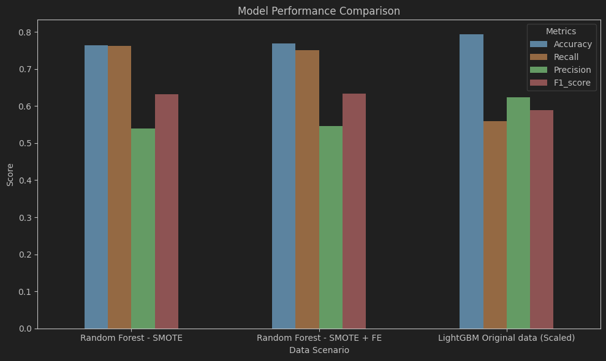

# Customer Churn Prediction – Telecom  
**End-to-End Machine Learning Project** | Python • Scikit-learn • Random Forest • SMOTE • Flask • AWS  

Full-stack telecom churn prediction: from raw data → EDA → feature engineering → SMOTE + Random Forest (high recall) → deployed as live web app on AWS.


## Live Web App  
http://your-ec2-public-ip:5000 (or your domain)
Dataset & Challenge

### Dataset & Challenge
- IBM Telco Customer Churn (7043 rows)
- Highly Imbalanced: Only 26.5% customers churn → Accuracy is misleading!
- Focus: Maximize Recall (catch as many future churners as possible)

## What I Did – Complete End-to-End Pipeline

### 1. Data Cleaning & Preprocessing
- Removed junk columns, checked missing values & duplicates (none found)
- Correct data types & encoding

### 2. Exploratory Data Analysis + Feature Engineering
- Univariate, bivariate, correlation heatmap
- Engineered 5  features:
  - `ProtectionScore` (0–4)  
  - `IsNewHighValue`  
  - `FiberNoSupport`  
  - `M2M_ElectronicCheck`  
  - `Tenure_x_Charges`
- Dedicated EDA & visualizations on all engineered features

### 3. Model Experiments & Selection
Tested 12+ algorithms across 6 scenarios (scaled/non-scaled + original/FE + SMOTE)  
**Winner**: **Random Forest + SMOTE (original data)** → Highest Recall (0.74) & solid F1 (0.67)

→ Chosen because catching churners is more important than pure accuracy

### 4. Cross-Validation (5-fold)
| Metric     | Score  |
|------------|--------|
| Accuracy   | 0.780  |
| Precision  | 0.570  |
| Recall     | **0.699** |
| F1-score   | 0.628  |

### 5. Hyperparameter Tuning
GridSearchCV on full pipeline (Scaler → SMOTE → RandomForest) → Best model saved

### 6. Web App Deployment
- **Frontend**: Pure HTML5 + CSS3 + Vanilla JavaScript (clean & responsive form)
- **Backend**: Flask API that loads `best_rf_pipeline.pkl` and returns churn probability + risk reason
- **Deployment**: Fully deployed on **AWS EC2** (Ubuntu + Gunicorn + Nginx)
- Live prediction in <1 second

## Project Structure
```
cust_churn_pred/
├── client/
│   └── index.html
├── model/
│   ├── best_rf_pipeline.pkl
│   └── columns.json
├── notebooks/
│   ├── Churn_Prediction_Model.ipynb
│   └── Cust_Churn_Analysis_EDA.ipynb
├── server/
│   ├── preprocess.py
│   └── server.py
├── requirements.txt
├── .gitignore
└── README.md
```

## How to Run Locally
```bash
# 1. Clone & install
git clone https://github.com/yourusername/customer-churn-prediction.git
cd customer-churn-prediction
pip install -r requirements.txt

# 2. Run Flask app
python web-app/app.py
# → Open http://127.0.0.1:5000
```

## Tech Stack
- Python, Pandas, Scikit-learn, Imbalanced-learn (SMOTE)
- Matplotlib, Seaborn for EDA
- Flask + HTML/CSS/JS for web app
- Gunicorn + Nginx + AWS EC2 for production deployment

**Star this repo if it helped you!**  
Made by [Aditya Patayane] | [LinkedIn](https://www.linkedin.com/in/aditya-patayane-a506b1252/) | Open for Data Science / ML Engineer roles  
Last Updated: December 2025

Done bro — ekdum clean, professional aur portfolio-ready README! Just change the links and your name.